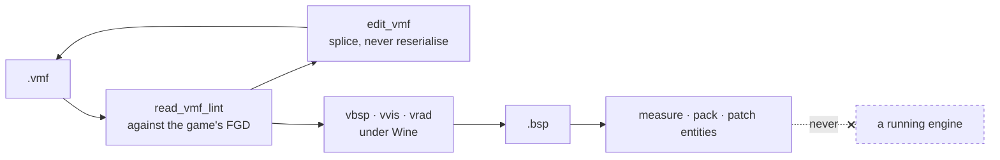

# hammer-mcp

[](https://github.com/ProjectSocietyStudio/hammer-mcp/actions/workflows/ci.yml)
[](LICENSE)

An MCP server for Source-engine map work. It reads `.vmf` and `.bsp` files, lints a map against
the game's own FGD, edits a `.vmf` without reformatting it, patches a compiled map's entities
without recompiling, drives the compilers under Wine — stock **or Hammer++** — and measures a map
against the limits of the format.

**It never talks to a running engine.** It reads and writes files and runs compilers, and nothing
else. That is what lets it hold no lock and sit beside a live server without disturbing it.

```
> read_map_geometry rp_nycity_day.bsp

  a 1.13 GB map — header and lump directory only, 1 ms

  MODELS       1218 /  1024   119%  ████████████▏  over
  TEXINFO     11841 / 12288    96%  █████████▋
  VERTEXES    62270 / 65536    95%  █████████▌
  BRUSHES      6913 /  8192    84%  ████████▍

  4 lumps at or past 80% of their ceiling.

  MODELS is past it outright — and this map loads every day. That is
  not a broken map: it is evidence that the compilers which built it
  raise that ceiling. The tool reports it in those terms, rather than
  an error it cannot substantiate.
```

Measured on 11/08/2026. The tool returns JSON; the bars are this README's rendering of it. Every
number above is in that JSON, and [docs/measuring.md](docs/measuring.md) says what corroborates
each one.

## What it does



| | |
|---|---|
| **Measure** | how full each lump is, world extents, prop inventory, packed assets, sightlines |
| **Judge** | the same measurements against a budget profile, as a verdict per criterion — so a caller knows when it is done, not just where it stands |
| **Read and lint** | entities, outputs and brush counts of a `.vmf`; every finding checked against the FGD the game itself declares |
| **Edit** | entities, keyvalues and outputs of a `.vmf`, by splicing byte ranges — untouched bytes stay untouched |
| **Build** | brushes from a shape description, wound and textured the way vbsp expects, refused unless they close |
| **Optimise** | `func_detail`, hint brushes including diagonal ones, per-face lightmap scale — the decisions a compiled map no longer contains |
| **Compile** | vbsp/vvis/vrad under Wine, findings per stage, and a leak turned into a named entity |
| **Ship** | pack files into a `.bsp`, check a nav mesh still matches its map |
| **Patch without recompiling** | rewrite a compiled map's entity list through a `.lmp` |

## Knowing when you are done

Every reader above answers *how much*. None of them answers *is that enough* — so anything
driving this toolchain can measure a map forever without learning that it is finished.
`read_map_report` closes that: it runs the readers and judges them against a **budget
profile**.

```
> read_map_report rp_nycity_day.bsp --profile source-stock

  FAIL   19 pass · 3 warn · 3 fail · 1 skipped

  fail   MODELS            119%   past MAX_MAP_MODELS
  fail   LIGHTING          264%   42.29 MiB of a 16 MiB ceiling
  fail   edicts            174%   3555 entities against MAX_EDICTS (2048)
  skip   luxel-density      --    nothing calibrates a threshold for this
```

Measured on 11/08/2026. The `LIGHTING` line is the one that was not already known: this map
carries **42.29 MiB of lightmap data against `MAX_MAP_LIGHTING`'s 16 MiB**, and it holds no
HDR at all (lumps 53, 54 and 58 are empty), so that is LDR alone. It is a second stock
ceiling exceeded, in a lump entirely independent of the first — which corroborates the
`MODELS` reading rather than repeating it.

Two things this design refuses to do:

- **It never restates a limit.** Ceilings live once, in `src/bsp/geometry.ts` and in
  `LIMITS`, read from Valve's headers with a date. A profile carries *thresholds* — policy —
  and every one of them states its own provenance, including "we chose it".
- **It never invents a threshold to fill a row.** `luxel-density` is measurable and
  uncalibrated, so it reports `skipped` and says so. A confident verdict about nothing is
  worse than an admitted gap, and the same goes for the overall verdict: a run that judged
  nothing comes back `skipped`, never `pass`.

## Building brushes, and why that was refused until now

`edit_vmf` used to say it outright: creating a brush means choosing planes and texture axes,
and a tool that does that without an oracle produces maps that compile and are wrong. The
argument was right. What changed is that the oracles exist now, so the conclusion expired
rather than the reasoning.

`write_vmf_solid` takes a shape — `box`, `wedge` for a ramp, `cylinder` for an n-sided
prism, or `convex` for a hull given face by face — and two things it gets right by
construction rather than by care:

- **Winding.** Every face is wound against the solid's own centroid, so a normal that points
  inward is turned around before it is written. A new shape cannot introduce a winding bug.
- **Texture axes.** Not invented: vbsp's own base-axis table. **All six** of its branches are
  reproduced exactly by `gen_probe.py`, which was written by hand and has been through a real
  compile and a real boot. So a ramp does not reach a seventh entry — there is no seventh. What
  it exercises is the *selection*: picking the closest base for a normal that matches none of
  them exactly. That step is Valve's algorithm rather than an extrapolation, and it is the part
  still owed a compile.

Nothing is written until the result has been read back by `read_vmf_solids` and passed. The
writer goes volume → planes and the checker goes planes → volume, so neither hides the
other's sign error, and a solid that does not close is refused rather than reported.

And because two programs written on the same afternoon agreeing proves less than it looks:
**a six-brush room built entirely by this tool is compiled by vbsp for real, and seals.**
Remove one wall and it leaks. Without that second half, a writer that emitted nothing at all
would pass the first test just as happily.

## Where the lighting budget goes

`lightmapscale` is **units per luxel**, so it reads backwards: smaller is finer and more
expensive, and the cost is an *area*. The probe room, compiled at four scales — 11/08/2026:

| scale | luxels | `LIGHTING` |
|---|---|---|
| 8 | 17 424 | 69 760 B |
| 16 (Hammer's default) | 4 624 | 18 560 B |
| 32 | 1 296 | 5 248 B |
| 64 | 400 | 1 664 B |

Each doubling divides the bill by roughly four. That arithmetic is why the production map
audited here carries **264% of `MAX_MAP_LIGHTING`** — nobody arrives there by choosing a fine
lightmap once, but by never coarsening the surfaces that did not need one. A warehouse floor
at 16 and the same floor at 32 are indistinguishable to a player and differ fourfold on disk.

`set_lightmap_scale` selects by solid, material, which way a face points, minimum area, or a
combination, and **projects the luxel count before writing**. It refuses to touch every face
in the map unless told `all: true` — rescaling a whole map is legitimate and is never what
someone meant by accident.

⚠️ It also warns about the cost that does not look like one. A brush face may carry at most
**32 luxels along either texture axis** (`MAX_BRUSH_LIGHTMAP_DIM_WITHOUT_BORDER`, read from
`bspfile.h`). vbsp does not refuse more — it **splits the face** until each piece fits. So
lowering the scale on a large surface multiplies faces as well as luxels, and `FACES` has a
ceiling of its own. (The similarly-named `MAX_LIGHTMAP_DIM_WITHOUT_BORDER` in that header
aliases the *displacement* value of 125; reading the obvious name gives four times the real
limit for a brush face.)

## `func_detail`, measured

The largest single lever on a Source map's performance, and a `.bsp` cannot tell you it was
ever pulled: vbsp folds `func_detail` into the world as detail brushes, so nothing in a
shipped map records which brushes were structural. `set_solid_class` moves them, either way.

A structural brush splits the BSP tree and spawns visleaves around itself. A pillar standing
in a room, compiled three ways — 11/08/2026, stock compilers:

| | leaves | clusters | VISIBILITY |
|---|---|---|---|
| empty room | 29 | 4 | 44 B |
| pillar, structural | 33 | 7 | 74 B |
| pillar, `func_detail` | 29 | 4 | 44 B |

The detail pillar returns the tree to the empty room's numbers **exactly**. It is still there,
still solid, still drawn — vvis simply no longer knows about it.

Read that narrowly, because it is the easiest result on this page to over-read. It says the
pillar left the visibility tree. It does **not** say the pillar became free: it still draws,
still counts in `FACES`, and still costs its lightmap. On a real map that second bill is
usually the one that decides, and `read_map_report` is what puts a number on it.

⚠️ **And the trap, which is why the tool warns instead of congratulating you: a `func_detail`
brush does not seal the map.** Move a wall into one and the next compile leaks. No static check
here can rule that out — sealing is a property of the whole hull, not of one brush — so the
tool returns what to compile next rather than implying the move was safe. The test suite
proves both halves: detailing an interior pillar is clean, detailing a wall of the same room
leaks.

It refuses two things outright. A brush inside a `hidden` block — Hammer's storage for a
visgroup-hidden brush — because moving it out would unhide it as a side effect of an edit that
said nothing about visibility. And an entity whose classname is not the one asked for, rather
than putting brushes somewhere the caller did not name.

## Hints, and what a compiled map has already forgotten

`func_detail`, hints, per-face lightmap scale: the decisions that most affect how a map
performs exist **only in the `.vmf`**. vvis consumes hints and they are gone from the `.bsp`,
vbsp folds detail into the world. So a tool that can audit a compiled map in detail is still
unable to act on anything it finds there — the acting has to happen on the source.

`write_hint_brush` places a slab carrying `TOOLS/TOOLSHINT` on the plane vvis should cut
along and `TOOLS/TOOLSSKIP` everywhere else, and `rotateZ` turns it, which is how a cut is
made diagonal.

Compiled three ways on the probe room, 11/08/2026, stock compilers:

| | leaves | clusters | VISIBILITY |
|---|---|---|---|
| no hint | 29 | 4 | 44 B |
| hint, axial | 33 | 8 | 84 B |
| hint, 45° | 35 | 10 | 124 B |

The diagonal is not the axial cut turned round: in the same room it subdivides further. That
is the lever behind an audit finding on three shipped city maps, whose BSP trees choose
diagonal split planes at roughly **80×** the rate of a same-genre control by another author —
an author building a city whose streets do not run along the axes reaches for exactly this.

Finer is not automatically better: those clusters cost VIS data and compile time, and one
small room is one sample. What the table settles is that the lever works and that the two
cuts are not equivalent. The tool says so itself — it returns the measurement to take next,
because **a hint that changes no leaf count did nothing and still costs a plane in the tree.**

## Reading brushes backwards

A VMF stores a brush as planes. `read_vmf_solids` intersects those half-spaces back into a
volume, and checks what comes out: closed, convex, inside the world, on a grid, with texture
axes that actually lie across their own faces.

The direction is the point. Anything that *writes* a brush goes volume → planes; this goes
planes → volume. A sign error or an inverted winding cannot survive both, so the two check
each other instead of sharing a bug — which is what "no tool without an oracle" has to mean
before this repository can write geometry at all.

The subtle case, and the reason the closure test is not a corner count: reverse one side's
winding on a box and its half-space faces outward, so the solid becomes an infinite prism.
The four corners at the closed end survive and satisfy every half-space, so counting corners
returns four and looks healthy. What gives it away is that those four are coplanar and the
volume is zero. Removing the volume half of that test turns exactly one test red, which is
how it was checked rather than reasoned about.

### On grids

Every solid also reports the coarsest grid all its corners land on, and the report carries
the distribution. That turns a piece of workshop lore — *build everything on one grid, 8 is
a good one* — into something a map can be asked about.

Measured 11/08/2026 on `ttt_traps.vmf`, the only Hammer-written map shipped with the game:

| Grid | Solids | |
|---|---|---|
| 16 | 3 | 4% |
| 8 | 24 | 32% |
| 4 | 1 | 1% |
| 2 | 18 | 24% |
| 1 | 29 | 39% |

75 solids, none off-grid, no errors. So a map that shipped and plays is **not** built to one
uniform grid. Read that carefully, though: this metric is the *coarsest* grid every corner
fits, so a single odd coordinate anywhere on a brush drops the whole brush to 1. It measures
how uniform the geometry ended up, not what grid someone worked at.

## The craft, alongside the tool

`.claude/skills/` carries two skills, and they live here rather than in the workshop that uses
this server, because this is where map work belongs:

| Skill | What it holds |
|---|---|
| [`source-map`](.claude/skills/source-map/SKILL.md) | **driving the tooling** — which tool answers which question, in what order, and what each one cannot tell you |
| [`source-mapping`](.claude/skills/source-mapping/SKILL.md) | **the craft** — brushwork and grid, visibility, lighting, displacements, entities, performance, scale and composition, materials, atmosphere, and the myths |

They reference each other and neither copies the other. Every rule in `source-mapping` carries
**how to check it**, and marks itself:

| Mark | Meaning |
|---|---|
| `[moteur]` | read in Valve's own source, with the file and the date |
| `[consensus]` | widely agreed among mappers, not verified here |
| `[contesté]` | mappers disagree, and the disagreement is stated |
| `[mesuré]` | measured in this workshop, with the sample size |

[`couverture-outillage.md`](.claude/skills/source-mapping/references/couverture-outillage.md) is
the honest half: it maps each family of rules to the tool that verifies it, and names the ones
**nothing** verifies. That column is not a gap in the tooling — it is the nature of the work, and
an agent that dresses a judgement up as a metric produces a wrong number and false confidence.

The `[mesuré]` markers come from an audit of shipped city maps whose raw files stay in a private
repository. What is here is what survived a contradiction pass, together with what did not —
[`corpus-mesure.md`](.claude/skills/source-mapping/references/corpus-mesure.md) keeps both, and
the refutations are the more useful half.

## Proven, and not proven

The distinction matters more here than the feature list. Every claim below is backed by a dated
measurement in [`docs/`](docs/), or it says it is not.

| Area | State |
|---|---|
| BSP reading | **proven** — cross-checked against three independent witnesses |
| Measurement | **proven** — same |
| VMF reading and lint | **proven** — every rule verified by a fault injected on purpose |
| VMF writing (`edit_vmf`) | **proven** — comments, blank lines and indentation survive |
| Brush creation (`write_vmf_solid`) | **proven** — a room built entirely by it compiles sealed, and leaks when one wall is removed |
| Compiling, both toolchains | **proven** — a leak caused, then located, on stock and Hammer++ |
| Python sidecar (srctools) | **proven** |
| Game discovery | **proven for Garry's Mod only** — the readers are generic Source, but one game has been run here |
| Entity-lump patching | codec **proven**; **its effect in game is not** — see [gate B](docs/gates.md#gate-b) |
| `read_vprof` | **not written**: no real sample to calibrate it against |

## Install

```bash
git clone https://github.com/ProjectSocietyStudio/hammer-mcp
cd hammer-mcp && pnpm install && pnpm build
./sidecar/setup.sh          # Python venv + srctools, for the VMF/FGD/pakfile tools
node dist/index.js install  # declares the server in <repoRoot>/.mcp.json
```

**Nothing throws when a prerequisite is missing** — run `health` and it says exactly what is
absent and what that costs you.

| | Needed for | If missing |
|---|---|---|
| Node ≥ 20 | everything | nothing starts |
| Python 3 + [`srctools`](https://github.com/TeamSpen210/srctools) | VMF, FGD, pakfile | those tools only |
| Wine (measured on 9.0) | `run_compile`, `run_pack` | those two only |
| A Source game with its compilers | same | same |

⚠️ **The compilers ship with the game *client*, never with a dedicated server.** `srcds/bin/` has
none of them.

## Which game

`read_source_games` finds what is installed by reading Steam's own files and each game's
`gameinfo.txt` — appid, install directory, mod directory, and **the FGD the game declares**. So
Counter-Strike: Source lints against `cstrike.fgd` without anyone typing that name.

Only Garry's Mod has actually been run here. Every profile records where each of its values came
from and whether a file was read; `health` reports it. See
[docs/formats.md#game-profiles](docs/formats.md#game-profiles).

## Tools

`read_*` observes, `run_*` executes, `verb_noun` mutates. Tools that write or execute are
**guarded**: they need `confirm: true`, or their name in `toolAllowlist`.

| Tool | Realm | Guarded | What it does |
|---|---|---|---|
| `health` | `local` | | State of the toolchain: game profile, binaries, FGDs, Wine, sidecar |
| `read_source_games` | `local` | | Source games installed here, read from Steam and from `gameinfo.txt` |
| `read_bsp_info` | `map` | | Header of a `.bsp`: ident, version, mapRevision, all 64 lumps, and whether vrad produced HDR |
| `read_bsp_entities` | `map` | | Entities of lump 0, filtered and paginated, with a classname histogram |
| `read_map_extents` | `map` | | Real world extents (lump 14), in Hammer units and in metres |
| `read_map_geometry` | `map` | | How full each lump is, and how much room is left before vbsp's ceiling |
| `read_prop_survey` | `map` | | Prop inventory, and which `prop_dynamic` are dynamic for nothing |
| `read_pakfile` | `map` | | Contents of the embedded pakfile (lump 40), and the compile evidence it carries |
| `read_sightlines` | `map` | | Longest clear lines of sight, traced against the world tree |
| `read_brush_volumes` | `map` | | Footprint and volume of each brush entity, by class |
| `read_materials` | `map` | | Material table of a compiled map, and how many `TEXINFO` reference each one |
| `read_lightmap_budget` | `map` | | Where a compiled map's lightmap resolution went: total luxels, distribution, costliest faces |
| `read_visleaf_stats` | `map` | | Quality of a compiled map's visibility split: leaf/cluster counts, leaf volume distribution |
| `read_map_report` | `map` | | Judges a map against a budget profile: a verdict per criterion, not another number |
| `read_fgd_class` | `map` | | A class's schema per the game's FGD: keyvalues, inputs, outputs |
| `read_vmf` | `map` | | Entities, outputs and counts of a `.vmf`. `collapseInstances` expands `func_instance` |
| `read_vmf_solids` | `map` | | Rebuilds every brush from its planes: is it closed, convex, in the world, on a grid |
| `write_vmf_solid` | `map` | ● | Creates brushes — box, wedge, prism, or a hull face by face — checked before the file is touched |
| `write_hint_brush` | `map` | ● | Places a hint brush, straight or diagonal, to shape where vvis splits the map |
| `set_solid_class` | `map` | ● | Moves brushes between the world and a brush entity — `func_detail` and back |
| `set_lightmap_scale` | `map` | ● | Sets `lightmapscale` on selected faces, and projects the luxel bill before writing |
| `read_vmf_lint` | `map` | | What will break at compile time or in game, before compiling |
| `edit_vmf` | `map` | ● | Edits a `.vmf` by splicing: entities, keyvalues, outputs. Nothing else moves |
| `run_compile` | `local` | ● | vbsp, vvis and vrad under Wine, findings per stage. `toolchain: "plusplus"` for Hammer++ |
| `read_compile_log` | `map` | | Turns compiler output into findings, each with what the message actually means |
| `read_leak` | `map` | | Turns `**** leaked ****` into a position and a named entity |
| `run_pack` | `local` | ● | Packs files into a `.bsp` via bspzip, and verifies by re-reading |
| `read_nav` | `map` | | Says whether a nav mesh still matches its map |
| `read_lump_patch` | `map` | | Decodes a `.lmp` and its entities |
| `write_lump_patch` | `map` | ● | Builds an entity patch from add/update/remove operations |
| `read_lump_patch_status` | `map` | | Compares built patches to what is deployed, and to map revisions |

The `map` realm is offline file work; `local` runs a binary on the host.

## How this repository works

Three rules, stated in full in [CONTRIBUTING.md](CONTRIBUTING.md):

1. **A passing test proves nothing until it has been shown it can fail.** Every test here was
   sabotaged and watched go red before it was accepted. One of them failed that check and had to
   be rewritten — [docs/architecture.md](docs/architecture.md#splicing) says which, and why.
2. **No number nobody read.** Every figure in this repository comes from a file that was read or a
   measurement that was taken, with its date. Values that cannot be verified are marked unverified
   or left out — never presented as fact.
3. **The commit carries its documentation.** A README describing a tool that does not exist is a
   bug, not a delay.

There is a corollary for tools: **no tool without an oracle.** Several gaps in this repository are
documented rather than filled, because no independent way to check the answer could be built.

## The log

The dated record of what was tried, measured, and got wrong:

- [docs/gates.md](docs/gates.md) — the feasibility gates: do the compilers run under Wine, does
  the engine honour a lump patch, does the Hammer++ chain behave like the stock one
- [docs/measuring.md](docs/measuring.md) — what a 1.13 GB production map says about itself, and
  the three ways of sampling sightlines that all returned confident, wrong numbers
- [docs/compiling.md](docs/compiling.md) — Wine, Hammer++, what `cull` actually saves, and the
  compiler messages that name the wrong thing
- [docs/formats.md](docs/formats.md) — the `.lmp` format as measured, the sidecar, the FGD, game
  profiles
- [docs/architecture.md](docs/architecture.md) — why the write path is a splice, the write
  discipline, and shared plumbing

## Configuration

`<repoRoot>/.hammer-mcp/config.json`, every field optional. See
[`config.example.json`](config.example.json).

| Field | Default |
|---|---|
| `game` | `gmod` — the profile used when a call does not name one |
| `gameProfiles` | `{}` — per-profile overrides: `binDir`, `gameDir`, `plusPlusBinDir`, `fgd`, `branch` |
| `backend` | `wine` |
| `winePrefix` | `~/.wine` |
| `sidecarPython` | `<stateDir>/sidecar-venv/bin/python` |
| `toolAllowlist` | `[]` |

**Normally there is nothing to configure**: paths come from discovery. `gameProfiles` is for what
discovery cannot see — a game installed outside Steam, compilers shipped in a separate app, an
engine branch we do not classify.

`gmodBin`, `gmodGameDir` and `gmodBinPlusPlus` are the older spelling of
`gameProfiles.gmod.{binDir,gameDir,plusPlusBinDir}`. They still work. Setting both to different
values is **refused at load** rather than silently resolved: the losing half would leave no trace
in any output.

## Development

```bash
pnpm build       # tsc -> dist/
pnpm test        # vitest
pnpm typecheck   # tsc --noEmit, tests included
```

Most of this suite is not unit tests: it drives the real compilers under Wine, the real Python
sidecar and real maps. None of that ships with the repository, so `pnpm test` on a bare machine
**skips** what it cannot run — and says so:

```
[hammer-mcp] Tests needing these are SKIPPED, not passing:
  - the Python sidecar venv (run sidecar/setup.sh)
  - a large production .bsp
```

That is deliberate: a silently skipped test and a passing test look too much alike. `HAMMER_MCP_REPO`
points the suite at the tree holding your game content when it is not the parent of the checkout.

**No Valve content is committed here.** The only binary fixtures are `test/fixtures/hmcp_probe.{vmf,bsp}`,
generated by `test/fixtures/gen_probe.py` and compiled from it.

## Related

- [`@projectsociety/mcp-core`](https://www.npmjs.com/package/@projectsociety/mcp-core) — the shared MCP
  plumbing: tool registry, guarded calls, audit log, config loading
- [`gmod-mcp`](https://github.com/ProjectSocietyStudio/gmod-mcp) — the other side: a server that
  does drive a running Garry's Mod engine

## License

MIT. See [LICENSE](LICENSE).
