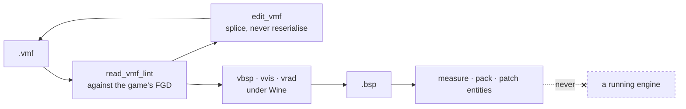

# hammer-mcp

[](https://github.com/ProjectSocietyStudio/hammer-mcp/actions/workflows/ci.yml)
[](LICENSE)

An MCP server for Source-engine map work. It reads `.vmf` and `.bsp` files, lints a map against
the game's own FGD, edits a `.vmf` without reformatting it, patches a compiled map's entities
without recompiling, drives the compilers under Wine — stock **or Hammer++** — and measures a map
against the limits of the format.

**It never talks to a running engine.** It reads and writes files and runs compilers, and nothing
else. That is what lets it hold no lock and sit beside a live server without disturbing it.

```
> read_map_geometry rp_nycity_day.bsp

  a 1.13 GB map — header and lump directory only, 1 ms

  MODELS       1218 /  1024   119%  ████████████▏  over
  TEXINFO     11841 / 12288    96%  █████████▋
  VERTEXES    62270 / 65536    95%  █████████▌
  BRUSHES      6913 /  8192    84%  ████████▍

  4 lumps at or past 80% of their ceiling.

  MODELS is past it outright — and this map loads every day. That is
  not a broken map: it is evidence that the compilers which built it
  raise that ceiling. The tool reports it in those terms, rather than
  an error it cannot substantiate.
```

Measured on 11/08/2026. The tool returns JSON; the bars are this README's rendering of it. Every
number above is in that JSON, and [docs/measuring.md](docs/measuring.md) says what corroborates
each one.

## What it does



| | |
|---|---|
| **Measure** | how full each lump is, world extents, prop inventory, packed assets, sightlines |
| **Read and lint** | entities, outputs and brush counts of a `.vmf`; every finding checked against the FGD the game itself declares |
| **Edit** | entities, keyvalues and outputs of a `.vmf`, by splicing byte ranges — untouched bytes stay untouched |
| **Compile** | vbsp/vvis/vrad under Wine, findings per stage, and a leak turned into a named entity |
| **Ship** | pack files into a `.bsp`, check a nav mesh still matches its map |
| **Patch without recompiling** | rewrite a compiled map's entity list through a `.lmp` |

## Proven, and not proven

The distinction matters more here than the feature list. Every claim below is backed by a dated
measurement in [`docs/`](docs/), or it says it is not.

| Area | State |
|---|---|
| BSP reading | **proven** — cross-checked against three independent witnesses |
| Measurement | **proven** — same |
| VMF reading and lint | **proven** — every rule verified by a fault injected on purpose |
| VMF writing (`edit_vmf`) | **proven** — comments, blank lines and indentation survive; no brush geometry |
| Compiling, both toolchains | **proven** — a leak caused, then located, on stock and Hammer++ |
| Python sidecar (srctools) | **proven** |
| Game discovery | **proven for Garry's Mod only** — the readers are generic Source, but one game has been run here |
| Entity-lump patching | codec **proven**; **its effect in game is not** — see [gate B](docs/gates.md#gate-b) |
| `read_vprof` | **not written**: no real sample to calibrate it against |

## Install

```bash
git clone https://github.com/ProjectSocietyStudio/hammer-mcp
cd hammer-mcp && pnpm install && pnpm build
./sidecar/setup.sh          # Python venv + srctools, for the VMF/FGD/pakfile tools
node dist/index.js install  # declares the server in <repoRoot>/.mcp.json
```

**Nothing throws when a prerequisite is missing** — run `health` and it says exactly what is
absent and what that costs you.

| | Needed for | If missing |
|---|---|---|
| Node ≥ 20 | everything | nothing starts |
| Python 3 + [`srctools`](https://github.com/TeamSpen210/srctools) | VMF, FGD, pakfile | those tools only |
| Wine (measured on 9.0) | `run_compile`, `run_pack` | those two only |
| A Source game with its compilers | same | same |

⚠️ **The compilers ship with the game *client*, never with a dedicated server.** `srcds/bin/` has
none of them.

## Which game

`read_source_games` finds what is installed by reading Steam's own files and each game's
`gameinfo.txt` — appid, install directory, mod directory, and **the FGD the game declares**. So
Counter-Strike: Source lints against `cstrike.fgd` without anyone typing that name.

Only Garry's Mod has actually been run here. Every profile records where each of its values came
from and whether a file was read; `health` reports it. See
[docs/formats.md#game-profiles](docs/formats.md#game-profiles).

## Tools

`read_*` observes, `run_*` executes, `verb_noun` mutates. Tools that write or execute are
**guarded**: they need `confirm: true`, or their name in `toolAllowlist`.

| Tool | Realm | Guarded | What it does |
|---|---|---|---|
| `health` | `local` | | State of the toolchain: game profile, binaries, FGDs, Wine, sidecar |
| `read_source_games` | `local` | | Source games installed here, read from Steam and from `gameinfo.txt` |
| `read_bsp_info` | `map` | | Header of a `.bsp`: ident, version, mapRevision, all 64 lumps, and whether vrad produced HDR |
| `read_bsp_entities` | `map` | | Entities of lump 0, filtered and paginated, with a classname histogram |
| `read_map_extents` | `map` | | Real world extents (lump 14), in Hammer units and in metres |
| `read_map_geometry` | `map` | | How full each lump is, and how much room is left before vbsp's ceiling |
| `read_prop_survey` | `map` | | Prop inventory, and which `prop_dynamic` are dynamic for nothing |
| `read_pakfile` | `map` | | Contents of the embedded pakfile (lump 40), and the compile evidence it carries |
| `read_sightlines` | `map` | | Longest clear lines of sight, traced against the world tree |
| `read_brush_volumes` | `map` | | Footprint and volume of each brush entity, by class |
| `read_materials` | `map` | | Material table of a compiled map, and how many `TEXINFO` reference each one |
| `read_lightmap_budget` | `map` | | Where a compiled map's lightmap resolution went: total luxels, distribution, costliest faces |
| `read_fgd_class` | `map` | | A class's schema per the game's FGD: keyvalues, inputs, outputs |
| `read_vmf` | `map` | | Entities, outputs and counts of a `.vmf`. `collapseInstances` expands `func_instance` |
| `read_vmf_lint` | `map` | | What will break at compile time or in game, before compiling |
| `edit_vmf` | `map` | ● | Edits a `.vmf` by splicing: entities, keyvalues, outputs. Nothing else moves |
| `run_compile` | `local` | ● | vbsp, vvis and vrad under Wine, findings per stage. `toolchain: "plusplus"` for Hammer++ |
| `read_compile_log` | `map` | | Turns compiler output into findings, each with what the message actually means |
| `read_leak` | `map` | | Turns `**** leaked ****` into a position and a named entity |
| `run_pack` | `local` | ● | Packs files into a `.bsp` via bspzip, and verifies by re-reading |
| `read_nav` | `map` | | Says whether a nav mesh still matches its map |
| `read_lump_patch` | `map` | | Decodes a `.lmp` and its entities |
| `write_lump_patch` | `map` | ● | Builds an entity patch from add/update/remove operations |
| `read_lump_patch_status` | `map` | | Compares built patches to what is deployed, and to map revisions |

The `map` realm is offline file work; `local` runs a binary on the host.

## How this repository works

Three rules, stated in full in [CONTRIBUTING.md](CONTRIBUTING.md):

1. **A passing test proves nothing until it has been shown it can fail.** Every test here was
   sabotaged and watched go red before it was accepted. One of them failed that check and had to
   be rewritten — [docs/architecture.md](docs/architecture.md#splicing) says which, and why.
2. **No number nobody read.** Every figure in this repository comes from a file that was read or a
   measurement that was taken, with its date. Values that cannot be verified are marked unverified
   or left out — never presented as fact.
3. **The commit carries its documentation.** A README describing a tool that does not exist is a
   bug, not a delay.

There is a corollary for tools: **no tool without an oracle.** Several gaps in this repository are
documented rather than filled, because no independent way to check the answer could be built.

## The log

The dated record of what was tried, measured, and got wrong:

- [docs/gates.md](docs/gates.md) — the feasibility gates: do the compilers run under Wine, does
  the engine honour a lump patch, does the Hammer++ chain behave like the stock one
- [docs/measuring.md](docs/measuring.md) — what a 1.13 GB production map says about itself, and
  the three ways of sampling sightlines that all returned confident, wrong numbers
- [docs/compiling.md](docs/compiling.md) — Wine, Hammer++, what `cull` actually saves, and the
  compiler messages that name the wrong thing
- [docs/formats.md](docs/formats.md) — the `.lmp` format as measured, the sidecar, the FGD, game
  profiles
- [docs/architecture.md](docs/architecture.md) — why the write path is a splice, the write
  discipline, and shared plumbing

## Configuration

`<repoRoot>/.hammer-mcp/config.json`, every field optional. See
[`config.example.json`](config.example.json).

| Field | Default |
|---|---|
| `game` | `gmod` — the profile used when a call does not name one |
| `gameProfiles` | `{}` — per-profile overrides: `binDir`, `gameDir`, `plusPlusBinDir`, `fgd`, `branch` |
| `backend` | `wine` |
| `winePrefix` | `~/.wine` |
| `sidecarPython` | `<stateDir>/sidecar-venv/bin/python` |
| `toolAllowlist` | `[]` |

**Normally there is nothing to configure**: paths come from discovery. `gameProfiles` is for what
discovery cannot see — a game installed outside Steam, compilers shipped in a separate app, an
engine branch we do not classify.

`gmodBin`, `gmodGameDir` and `gmodBinPlusPlus` are the older spelling of
`gameProfiles.gmod.{binDir,gameDir,plusPlusBinDir}`. They still work. Setting both to different
values is **refused at load** rather than silently resolved: the losing half would leave no trace
in any output.

## Development

```bash
pnpm build       # tsc -> dist/
pnpm test        # vitest
pnpm typecheck   # tsc --noEmit, tests included
```

Most of this suite is not unit tests: it drives the real compilers under Wine, the real Python
sidecar and real maps. None of that ships with the repository, so `pnpm test` on a bare machine
**skips** what it cannot run — and says so:

```
[hammer-mcp] Tests needing these are SKIPPED, not passing:
  - the Python sidecar venv (run sidecar/setup.sh)
  - a large production .bsp
```

That is deliberate: a silently skipped test and a passing test look too much alike. `HAMMER_MCP_REPO`
points the suite at the tree holding your game content when it is not the parent of the checkout.

**No Valve content is committed here.** The only binary fixtures are `test/fixtures/hmcp_probe.{vmf,bsp}`,
generated by `test/fixtures/gen_probe.py` and compiled from it.

## Related

- [`@projectsociety/mcp-core`](https://github.com/ProjectSocietyStudio/mcp-core) — the shared MCP
  plumbing: tool registry, guarded calls, audit log, config loading
- [`gmod-mcp`](https://github.com/ProjectSocietyStudio/gmod-mcp) — the other side: a server that
  does drive a running Garry's Mod engine

## License

MIT. See [LICENSE](LICENSE).
